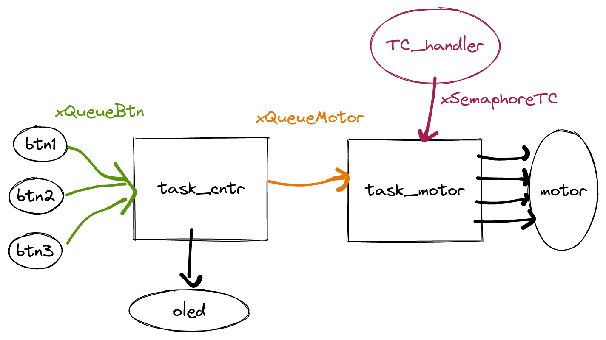

# 22a - EMB - AV4

- A prova é prática, com o objetivo de avaliar sua compreensão a cerca do conteúdo ministrado pela disciplina.
- É permitido consulta a todo material pessoal (suas anotações, códigos) e publico (github e internet), mas não pode consultar outros alunos.
- **Lembre que e' boa prática a cada 30 minutos fazer um commit no seu código!**
- Duração total: 2h + 1h extra

> Criar o repositório de entrega pelo link:
>
> - https://classroom.github.com/a/cFcTMHtX
>
> Use como base o código disponível neste repositório.

**Você vai precisar:**

- ▶️ Kit SAME70-XPLD
- ▶️ Conectar o OLED1 ao EXT-1
- ▶️ Motor de passo

**Periféricos que vai precisar utilizar:**

- Botões e Leds (OLED)
- PIO
- TC
- Uart console (printf)

**Código exemplo fornecido:**

No código fornecido (e que deve ser utilizado) os botões e LEDs da placa OLED já foram inicializados na função (io_init) e os callbacks dos botões já estão configurados. Temos uma task_oled que é inicializada e fica exibindo no OLED um ponto piscando. Pedimos para não mexer nessa task, pois ela serve de debug para sabermos se seu programa travou (se parar de piscar tem alguma coisa errado com o seu programa).

É comum o uso de sistemas embarcados para o controle de dispositivos do mundo físico operando em conjunto com outros processadores, neste caso fica a cargo do microcontrolador realizar as tarefas mais críticas e de tempo real.

Nesta avaliação iremos desenvolver um firmware para controlar um motor de passos.

## Motor de passos

O motor de passos é um eletromecanismo que quando acionado corretamente faz um rotor girar. Motores de passo são bastante utilizados em aplicações que necessitam controlar a posição angular de alguma coisa. São pouco usados e não indicados para simplesmente "fazer alguma coisa" girar constantemente.

### Funcionamento

O motor deve ser controlado por quatro bobinas que serão acionadas em sequência. A sequência define o sentido de rotação do motor. Por exemplo: [1,2,3,4] gera uma revolução elétrica no motor no sentido horário e [4,3,2,1] uma revolução elétrica no sentido anti-horário, como indicado no gif a seguir:


#### Revolucão Elétrica vs Mecânica

Uma revolução elétrica é a execucão de uma sequência de acionamento das fases do motor, cada motor possui uma relação de rev. elétrica X mecânica.

> No nosso motor, precisamos executar 500 rev. elétricas para uma volta completa mecânica.
> Ou seja, uma rev elétrica equivale a 360/500 graus

#### Velocidade

A velocidade de rotação do motor depende de quão rápido as fases são ativadas. Neste projeto vocês devem usar os seguintes delays para as velocidades indicadas:

| Velocidade | Tempo (ms) |
| ---------- | ---------- |
| 1          | 100        |
| 2          | 50         |
| 3          | 25         |
| 4          | 10         |

## Firmware

O projeto deve funcionar da seguinte maneira: Os botões da placa OLED irão servir como interface para o controle do motor, sendo: o BTN1 servirá de liga/desliga; o BTN2 de controle do sentido de rotação (horário/ anti-horário) e o BTN3 de controle da velocidade. O OLED deve exibir as informações de controle do motor:

- status: Ligado/Desligado
- sentido de rota: Horário / Anti-horário
- velocidade: 1,2,3,4

Considere a como condições iniciais de funcionamento:

- status: Desligado
- sentido de rota: Horário
- velocidade: 1 (100 ms)

A `task_motor` deve usar um TC para implementar o cálculo do tempo de mudança de fases.

### Conexão

Vocês devem escolher 4 pinos do microcontrolador e configurar como saída, cada pinos irá acionar uma das fases do motor.

### Estrutura

Vocês irão estruturar o firmware como indicado a seguir:



A ideia é que teremos uma task para fazer a leitura dos botões, lógica de controle e exibição no OLED e outra task dedicada para o controle do motor.

#### task_cntr

| Recurso         | Descrição                                         |
| --------------- | ------------------------------------------------- |
| PIO             | Leitura dos botões                                |
| OLED            | Escrita no OLED                                   |
| --------------- | ------------------------------------------------- |
| `xQueueBtn`     | Recebimento dos eventos de botão                  |
| `xQueueMotor`   | Envio das informacões para acionamento do motor   |

A `task_cntr` será responsável por fazer a leitura dos botões e exibição no OLED do status atual do motor (velocidade, direção e status). Os botões devem ser configurados com callback e se comunicar com a `task_cntr` via a fila `xQueueBtn`. Os botões do OLED terão as seguintes funções:

- `BTN1`: Irá controlar se o motor irá estar ligado/desligado.

> Se o motor estiver desligado as fases não devem ser acionadas, se estiver ligado, as fases devem ser acionadas conforme configuração. Inicialmente começa como desligado.

- `BTN2`: Controla o sentido de rotação do motor

> Quando clicado inverte o sentido, ou seja, o motor inicia em um sentido e quando o botão é clicado a sequência de acionamento inverte para o outro sentido.Inicialmente começa no sentido horário.

- `BTN3`: Selecão da velocidade de rotação do motor: 1,2,3, 4.

> A velocidade do motor impacta no tempo em que as fases serão acionadas, seguindo a tabela indicada anteriormente. Ao apertar o BTN3 a sequência deve ciclar entre: 1,2,3,4,1,2,3,4...Inicialmente começa com velocidade 1.

Após o processamento da informação vinda dos botões, a task deve exibir no OLED o novo status (ligado/desligado, sentido e velocidade) e também enviar essas informações para a fila `xQueueMotor`, que servirá de interface entre as duas tasks. A fila deve ser formada por uma struct como indicada a seguir:

```c
typedef struct {
  uint status; // 0 desligado, 1 ligado
  uint dir; // 0 horário, 1 anti-horário
  uint vel; // 1, 2, 3, 4
} motorData;
```

#### task_motor

| Recurso         | Descrição                                      |
| --------------- | ---------------------------------------------- |
| PIO             | Acionamento das fases do motor                 |
| TC              | Contagem de tempo                              |
| --------------- | ---------------------------------------------  |
| `xQueueMotor`   | Recebimento de novas configurações do motor    |
| `xSemaphoreTC`  | Indica que pode passar para o novo acionamento |

Task responsável por acionar o motor, deve receber as informações na fila de: `status`, `direcao` e `velocidade` e acionar as fases do motor.

As fases devem ser acionadas na sequência, como indicado no pseudo código:

```
while(1) {
    fase1 = 1; fase2 = 0; fase3 = 0; fase4 = 0;
    espera_tempo_semaforo
    fase1 = 0; fase2 = 1; fase3 = 0; fase4 = 0;
    espera_tempo_semaforo
    fase1 = 0; fase2 = 0; fase3 = 1; fase4 = 0;
    espera_tempo_semaforo
    fase1 = 0; fase2 = 0; fase3 = 0; fase4 = 1;
    espera_tempo_semaforo
}
```

E para o anti-horário:

```
while(1) {
    fase1 = 0; fase2 = 0; fase3 = 0; fase4 = 1;
    espera_tempo_semaforo
    fase1 = 0; fase2 = 0; fase3 = 1; fase4 = 0;
    espera_tempo_semaforo
    fase1 = 0; fase2 = 1; fase3 = 0; fase4 = 0;
    espera_tempo_semaforo
    fase1 = 1; fase2 = 0; fase3 = 0; fase4 = 0;
    espera_tempo_semaforo
}
```

Para o cálculo do tempo vocês devem usar um TC que irá indicar a cadência de quando devem mudar o acionamento das fases, a cada evento do TC uma nova fase deve ser acionada. A frequência de operação do TC deve ser de acordo com a velocidade de rotação compartilhada na fila `xQueueMotor`.

## Dicas

Comece pela `task_cntr` e depois faca a `task_motor` sem integrar as duas, por último faça a integração.

<!--
A seguir dicas do que fazer (foram os passos que eu segui):

Comece pela `task_cntr` e faca ela exibir as informacoes iniciais no OLED:

1. crie uma funcão `oled_display(...)` que recebe as informacoes e atualiza o OLED
1. Implemente os botões e faca o envio do ID para a fila `xQueueEvent`
1. Processe na task o evento de cada botão, e atualize as informacoes no oled.
1. Crie a fila `xQueueMotor` e a cada novo status formate o dado na struct `motorData` e faca o envio na fila.

Agora esqueca a `task_cntr` vamos fazer o motor girar apenas pela `task_motor`, no final só será necessário fazer a leitura da fila e atualizar os parâmetros internos da task.

1. Escolhe os pinos que serão utilizados e os configure como output
1. Crie uma funcão chamada de `motor_update(int fases[4])` que recebe um vetor de fases e aciona o pino conforme indicado em cada um dos index do vetor.
 -->

## Rubrica

A rubrica a seguir deve ser seguida:

### C

- `task_cntr`: Faz a leitura dos botões (`xQueueBtn`), acionamento do OLED e envio das informações para a fila `xQueueMotor`.
  - `BTN1` status: on/off
  - `BTN2` direção: horário, anti-horário
  - `BTN3` velocidade: 1,2,3,4
- `task_motor`: Faz o controle das fases do motor de passo, recebendo a informação pela fila `xQueueMotor`, a task faz uso de um TC para contagem de tempo a comunicacão entre a task e o TC é feita pelo semáforo `xSemaphoreTC`.
- Variáveis globais: **Apenas as filas e semáforos**

### Melhorando a nota

Cada item a seguir melhora a nota de uma maneira específica:

- (meio conceito): Usa RTT no lugar do TC
- (um conceito): Após o start, o motor da uma volta completa e para.
  > Precisa criar um semáforo de comunicação entre `task_motor ---> task_cntr` para indicar o fim de uma volta completa.
- (um conceito): Permite controlar o motor pela UART (recebimento de informações pelo terminal)
- (meio conceito): Aciona dois motores ao mesmo tempo (com a mesma config)
  > Precisa criar uma nova task e uma nova fila para o novo motor
- (meio conceito): Organiza o código em funções
- (meio conceito): Apresentar no display OLED a velocidade do motor em RPM.
